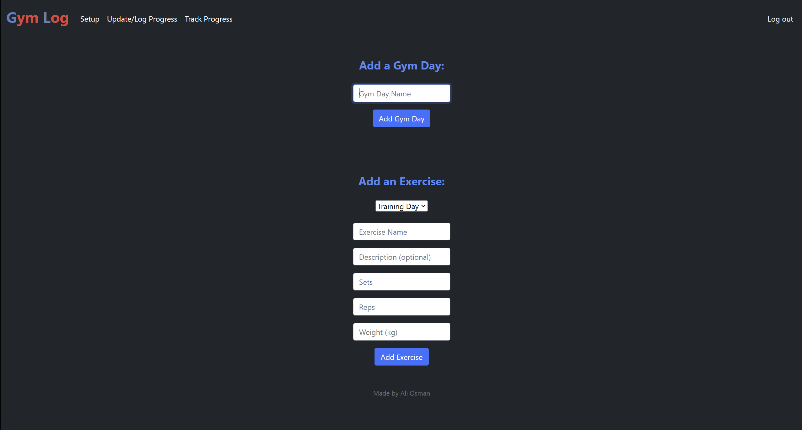
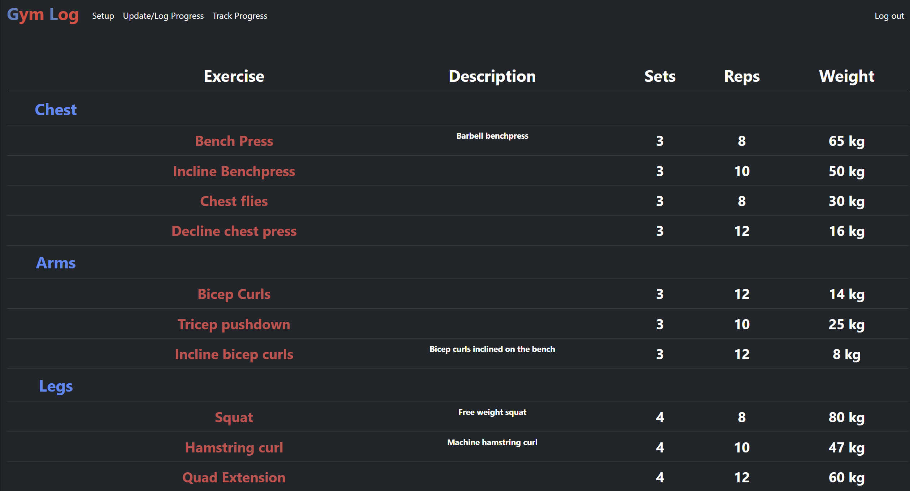

# Gym Log Website
A gym log website to help keep track of progress.

# Usage
Git clone the repository:
```
git clone https://github.com/Jailior/gymlog.git
```

Install required libraries:
```
pip install -r /PATH/requirements.txt
```
Run the app!
```
python app.py
```

# About
I decided to make a gym log because in my daily life when looking for a gym log for my use I didn't find any that had the ease of use that I needed. 
An important part of the gym is to track your progress in sets, reps and weights. I made the gym log customizable for any workout split. This website is useful to me and I hope can be useful to others.

Here is how you can expect to add exercises to the log:


And this is an example of how a populated gym log looks like:



Made by [Ali Osman](https://github.com/Jailior)
